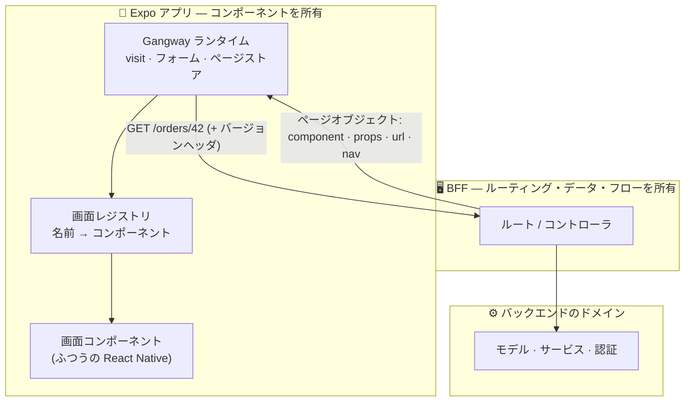
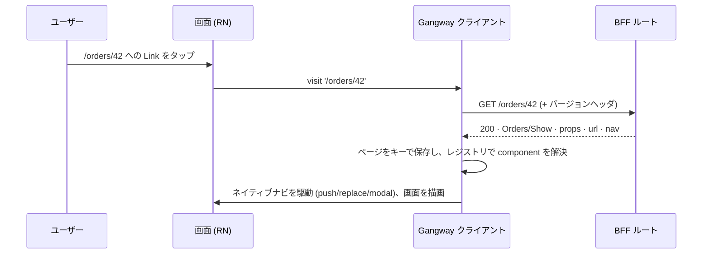
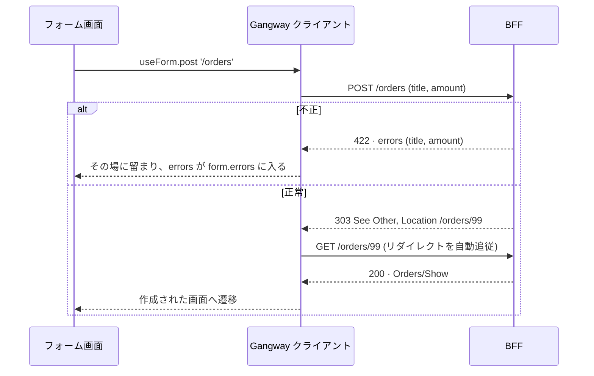
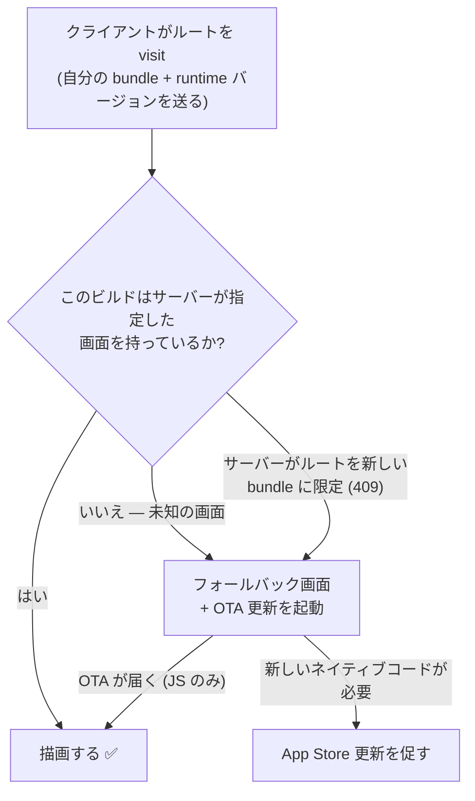
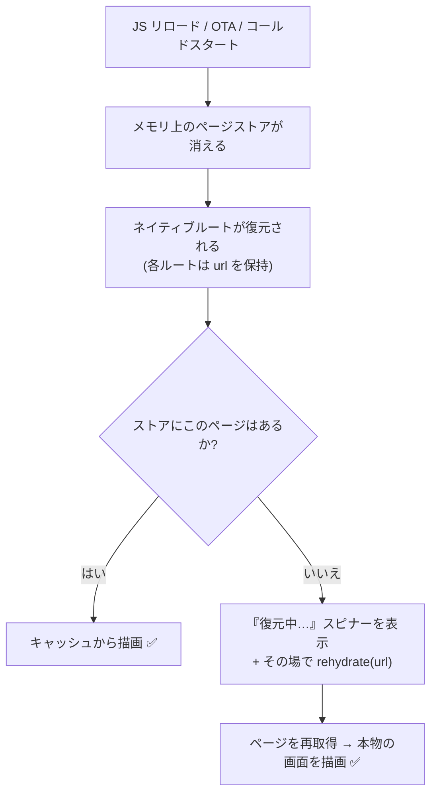

<!-- GitHub 上でそのまま表示されます: Mermaid の図は画像として描画され、
     以下の各 ▸ セクションはクリックで開閉する <details> ブロックです。
     ビルド不要・別タブ不要。 -->

# Gangway の仕組み

[English](./HOW-IT-WORKS.md) | **日本語**

**Gangway は React Native 版の [Inertia.js](https://inertiajs.com) です。** どの画面をユーザー
に見せるかを**バックエンド**が決め、その画面にデータを渡します。**アプリ**側は画面
（コンポーネント）を持っているだけで、それをネイティブに描画します。あいだに、設計・
バージョン管理・同期の必要な REST/GraphQL API はありません。

> **このページの読み方は2通り。** 下のピッチと図をざっと見れば2分で概要がつかめます。
> アーキテクチャを知りたい場合は、各 **▸ セクション**を開いてください。図とより詳しい解説が
> 展開されます。

---

## 一枚の図で見るアイデア



サーバーは UI マークアップやコンポーネントツリーを送りません。画面を**名前で指定**し、props を
渡すだけの小さな**ページオブジェクト**を返します:

```jsonc
{ "component": "Orders/Show", "props": { "order": { … } }, "url": "/orders/42", "version": "1" }
```

アプリはその名前を**レジストリ**で引き、対応する React Native コンポーネントを描画します。
この一段の間接化こそが肝で、以下のすべてを可能にしています。

---

## なぜ価値があるのか

- **API レイヤーが不要。** ルーティング・データ取得・認可・バリデーションがサーバーの一箇所に
  集約されます。REST/GraphQL の面を作ってバージョン管理する必要がなく、クライアント側に
  サーバー状態のキャッシュ（無効化の悩み）もありません。
- **アプリストアのリリースなしで UX を出荷できる。** サーバーが画面を選びフローを制御するため、
  チェックアウトの並べ替え、確認ステップの挿入、次に読み込む画面の変更などを**コントローラ
  1つ**の編集で行えます。インストール済みのすべてのアプリが、次の visit で反映します。
- **JSON UI ではなく本物のネイティブ画面。** 画面はジェスチャー・アニメーション・リスト性能を
  フルに使える、ふつうの React Native コンポーネントです。Gangway が駆動するのは*ナビゲーション
  とデータ*であってビューツリーではないので、最大公約数的な UI レンダラーに堕しません。
- **フォームがタダで手に入る。** ルートに POST すれば、成功時はサーバーが次の画面へリダイレクト
  し、失敗時は同じ画面にバリデーションエラーが返ります。クライアント側のバリデーション配線は
  不要です。
- **エンドツーエンドで型付け。** TypeScript のモノレポなら、アプリはサーバーのページマップの
  *型*を import するので、画面の props がコントローラの返り値と一致するかコンパイル時に検査
  されます。

**正直なトレードオフ。** Gangway は**オンライン前提**です。ナビゲーションのたびにサーバーへの
往復が発生します（プリフェッチ/キャッシュで緩和できますが、オフライン前提のアプリには不向き
です）。また、ネイティブの**ナビゲーション構造**（タブ、スタック）はアプリ側に残ります。
サーバーが選ぶのは*どの画面か*であって、シェル全体ではありません。

---

## 全体の流れを ~20 行で

**サーバー** — コントローラが型付き props とともに名前付きページを返す:

```ts
// apps/server/src/index.ts
app.get('/orders/:id', (c) => {
  const order = orders.find((o) => o.id === Number(c.req.param('id')))
  if (!order) return c.notFound()
  return gangway.page(c, 'Orders/Show', { order }) // ← 画面名 + props
})
```

**アプリ** — ふつうの画面がその props を受け取る（共有ページマップで型付け）:

```tsx
// apps/mobile/src/screens/OrdersShow.tsx
export default function OrdersShow({ order }: PageProps<'Orders/Show'>) {
  const visit = useVisit()
  return (
    <Screen>
      <Title>{order.title}</Title>
      <Button label="Archive" onPress={() => visit(`/orders/${order.id}/archive`, { method: 'POST' })} />
    </Screen>
  )
}
```

**アプリ** — レジストリはこの契約のクライアント側の半分（そのキー集合＝このビルドが描画できるもの）:

```tsx
// apps/mobile/src/registry.tsx
export const registry = { 'Orders/Show': OrdersShow /* … */ }
```

これだけです。サーバーが `Orders/Show` と言えば、アプリは `OrdersShow` を描画します。あとは
詳細で、以下で展開できます。

---

<details>
<summary><b>▸ visit の仕組み</b> — タップからネイティブ画面の描画まで</summary>

すべてのナビゲーションは **visit** です。リクエストがページオブジェクトとして返り、ランタイムが
それを保存してネイティブルーターに渡します。



**ネイティブスタックはキーを保持し、ページオブジェクトはストアに置かれます。** *戻る*ときは、
ページがまだキャッシュされている前のキーへ pop するだけなので、**戻るときに再取得しません**
——ネイティブアプリそのものです。サーバーは `nav` インテント（`push` · `replace` · `modal` ·
`resetTo` · `back`）を付けて、画面が*どう*入るかを指定できます。フォームがアプリの判断なしに
モーダルで開くのは、この仕組みです。

</details>

<details>
<summary><b>▸ フォーム・バリデーション・リダイレクト</b> — Inertia 由来の一番おいしい部分</summary>

ルートに送信します。サーバーが処理して**リダイレクト**するので、変更(mutation)と次の画面が
1往復で届きます。バリデーション失敗は同じ画面にエラーとして返ります。



設計すべき 422-JSON の API 契約も、クライアント側のバリデーションライブラリも、「成功したら…へ
遷移」の手動配線もありません。フローはサーバーが所有します。

</details>

<details>
<summary><b>▸ ページオブジェクト</b> — クライアント/サーバー間の契約のすべて</summary>

小さな JSON 一つがワイヤプロトコルの全体です（Inertia を下敷きに、モバイル向けの `nav`
インテントを追加）:

| フィールド | 意味 |
|---|---|
| `component` | アプリがレジストリで解決する画面名。例: `"Orders/Show"` |
| `props` | その画面のデータ。常に `errors` オブジェクトを含む |
| `url` | このページの正規 URL（キャッシュ + 再水和(rehydration)に使用） |
| `version` | サーバーが期待するバンドルバージョン。ズレたら自己更新を駆動 |
| `nav` | 画面をネイティブにどう配置するかを伝える省略可能な `{ action }` |

名前 + props にすぎないので、アプリが構造的に未知のものを描画するよう求められることはありません。
「欠けうる」のは画面まるごとだけで、これは1回のルックアップで検知できる単一のケースです
（次のセクション）。コンポーネント*ツリー*をストリームする server-driven-UI フレームワークとは
対照的で、あちらでは任意のペイロードの任意のノードがクライアントに無いものを参照しえます。

</details>

<details>
<summary><b>▸ アプリストアの遅延への対処</b> — 2つの壁とフォールバック</summary>

モバイルのフリートには常に古いクライアントが混在し、ネイティブコードはホットスワップできません。
Gangway はデプロイがアトミックだと装うのではなく、それを前提に設計されています。



- **JS だけのギャップ**（React Native で書かれた新しい画面）は Expo Updates で**無線経由(OTA)**
  で埋められます——ストア審査なし。
- **ネイティブのギャップ**（新しいネイティブモジュール）はストアビルドが必要です。アプリの
  `runtimeVersion` がその境界を追跡し、サーバーは古いクライアントには描画できるものを返し続けます。
- どちらの場合もユーザーには**一級市民としてのフォールバック画面**（「新しいものが届いています、
  更新中…」）が表示され、タップが壊れることはありません。OTA は非同期なので、このフォール
  バックはエラーではなく設計されたステートです。

Expo が前提なのはこのためです。`expo-updates` + `runtimeVersion` こそが、この回復の仕組みです。

</details>

<details>
<summary><b>▸ リロードを生き延びる</b> — ルートの再水和 (route rehydration)</summary>

ページストアはメモリ上にありますが、ネイティブのルートはそれより長生きします（JS リロード、
OTA の `reloadAsync()`、OS がナビゲーションを復元するコールドスタートなど）。そこで**すべての
ルートは自分の URL を保持**し、データを失った画面はその場で自分自身を再取得します。



復元された各画面は独立して回復するので、復元されたスタック全体が息を吹き返します。いったん
再水和すれば、戻るナビゲーションは再びキャッシュのみになります。（この同じ仕組みが、ディープ
リンクや通知の基盤にもなります。）

</details>

<details>
<summary><b>▸ 他とどう違うか</b> — Gangway の立ち位置</summary>

| アプローチ | UI を描画するのは | サーバーがナビを制御? | リリースなしで UX を出荷? | 画面は… |
|---|---|---|---|---|
| **REST/GraphQL + クライアントルーティング** | クライアント | ❌ | ❌ | ネイティブだが API を自作しバージョン管理 |
| **フル server-driven UI**（Airbnb Ghost, Rise） | サーバーがコンポーネント*ツリー*を送る | ✅ | ✅ | レンダラーに制約され、失敗面が広い |
| **Hyperview** | サーバーが XML ハイパーメディアを送る | ✅ | ✅ | React Native ではなく HXML ドキュメント |
| **Expo Router + RSC** | サーバーコンポーネント | 部分的（ルーティングが弱点） | ✅ | ネイティブだが実験的。サーバー主導ナビは未対応 |
| **Gangway** | **クライアント**（サーバーは画面を名前で指定） | ✅ | ✅ | **本物の React Native**、失敗面は1ルックアップ |

Gangway の賭け: 手書きのネイティブ画面の表現力を保ちつつ、Inertia が Web でやるように
ルーティング/データ/フローをサーバーに所有させる——他の RN フレームワークがまだ埋めていない
スロットです。

</details>

<details>
<summary><b>▸ 使うべきとき（と使わないべきとき）</b></summary>

**よく合う**

- コンテンツ/フロー中心のアプリ: マーケットプレイス、コマース、ダッシュボード、社内ツールなど、
  画面が「データ取得 → 表示 → 操作 → どこかへ遷移」であるもの。
- すでにバックエンドを持ち、モバイル専用 API を別途作ってバージョン管理したくないチーム。
- フローを頻繁に改善し、アプリストアのサイクルなしで出荷したいプロダクト。

**合わない**

- **オフライン前提**のアプリ——ナビゲーションのたびに往復が発生します。
- 画面に何を出すかにサーバーがほとんど関与しない、クライアント主導で高度にインタラクティブな面
  （ゲーム、エディタ、キャンバス）。

</details>

---

## さらに深く

- **[DESIGN.md](./DESIGN.md)** — 完全な仕様: ワイヤプロトコル、レイヤー境界、バージョンズレ戦略、
  ロードマップ、未解決の論点。（英語）
- **[E2E.md](./E2E.md)** — 実機シナリオのランブック（「動く」が何を検証済みで意味するか）。（英語）
- **コード:** [`packages/protocol`](./packages/protocol)（契約）·
  [`packages/server`](./packages/server)（BFF ヘルパ）·
  [`packages/client`](./packages/client)（ランタイム + Expo Router アダプタ）·
  [`apps/`](./apps)（全パスを通すデモ BFF + Expo アプリ）。

> プロトタイプ、暫定名 _gangway_。API は不安定ですが、大事なのはアイデアです。
