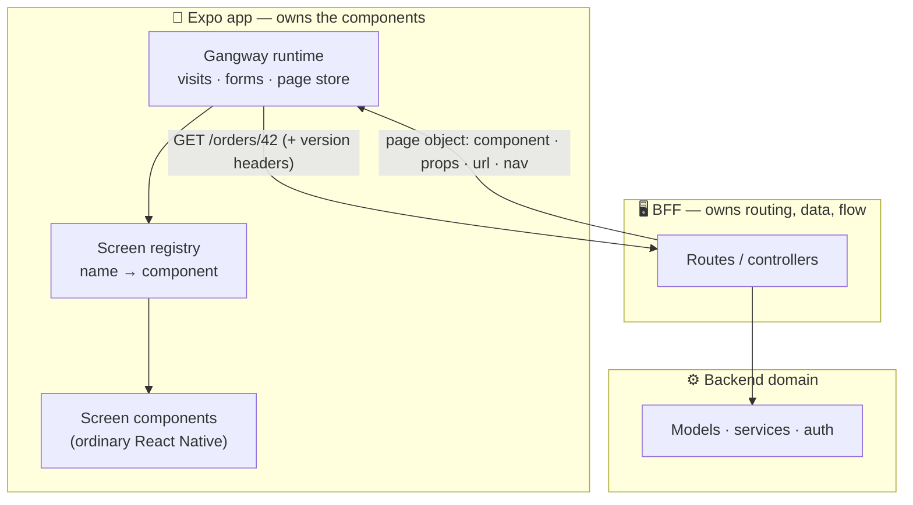
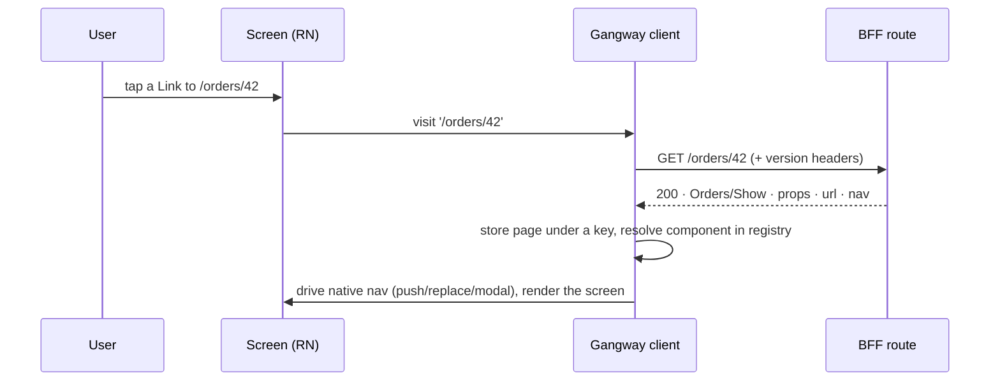
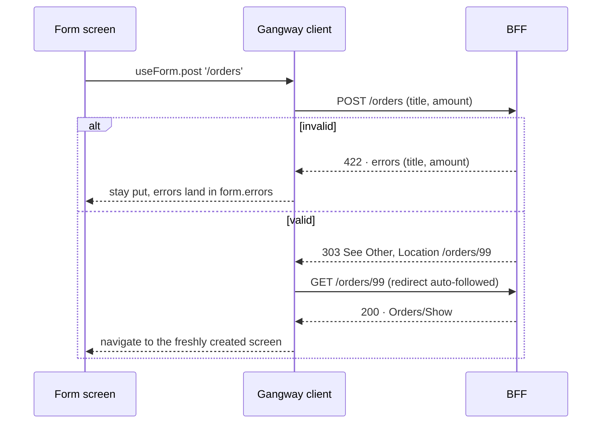
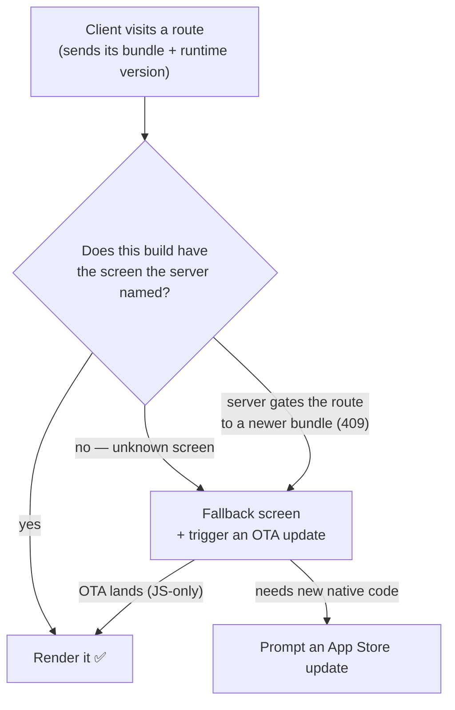
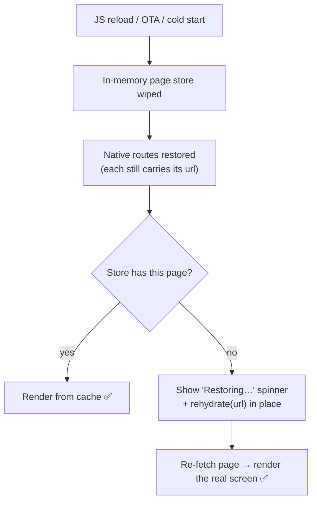

<!-- Renders inline on GitHub: Mermaid diagrams draw as pictures, and every
     ▸ section below is a click-to-expand <details> block. No build step, no
     separate tab. -->

# How Gangway works

**Gangway is [Inertia.js](https://inertiajs.com) for React Native.** Your **backend** decides
which screen the user sees and hands it the data; your **app** just holds the screens and
renders them natively. There's no REST/GraphQL API in between to design, version, or keep in
sync.

> **Two ways to read this page.** Skim the pitch and the picture below for the 2‑minute
> version. Want the architecture? Expand any **▸ section** — each opens a diagram and a
> deeper explanation.

---

## The idea in one picture



The server never sends UI markup or component trees. It sends a tiny **page object** that
_names_ a screen and gives it props:

```jsonc
{ "component": "Orders/Show", "props": { "order": { … } }, "url": "/orders/42", "version": "1" }
```

The app looks that name up in its **registry** and renders the matching React Native component.
That one indirection is the whole trick — and it's what makes everything below possible.

---

## Why it's worth it

- **No API layer.** Routing, data-loading, authorization, and validation live in one place on
  the server. You don't build or version a REST/GraphQL surface, and the client has no
  server-state cache to invalidate.
- **Ship UX changes without an app-store release.** Because the server chooses screens and
  controls the flow, you can reorder a checkout, insert a verification step, or change what
  loads next by editing **one controller** — every installed app picks it up on the next visit.
- **Real native screens, not JSON UI.** Screens are ordinary React Native components with full
  gestures, animations, and list performance. Gangway drives _navigation and data_, not your
  view tree — so it never becomes a lowest-common-denominator UI renderer.
- **Forms for free.** Post to a route; on success the server redirects you to the next screen,
  on failure you get validation errors back on the same screen — no client validation plumbing.
- **End-to-end typed.** In a TypeScript monorepo the app imports the server's page-map _type_,
  so a screen's props are checked against what its controller returns, at compile time.

**Honest tradeoffs.** Gangway is **online-first** — every navigation is a server round-trip
(prefetch/caching soften this, but offline-first apps are the wrong fit). And native
**navigation structure** (tabs, stacks) stays in the app; the server picks _which screen_
you're on, not your whole shell.

---

## The whole loop, in ~20 lines

**Server** — a controller returns a named page with typed props:

```ts
// apps/server/src/index.ts
app.get('/orders/:id', (c) => {
  const order = orders.find((o) => o.id === Number(c.req.param('id')))
  if (!order) return c.notFound()
  return gangway.page(c, 'Orders/Show', { order }) // ← screen name + props
})
```

**App** — an ordinary screen consumes those props (typed via the shared page map):

```tsx
// apps/mobile/src/screens/OrdersShow.tsx
export default function OrdersShow({ order }: PageProps<'Orders/Show'>) {
  const visit = useVisit()
  return (
    <Screen>
      <Title>{order.title}</Title>
      <Button label="Archive" onPress={() => visit(`/orders/${order.id}/archive`, { method: 'POST' })} />
    </Screen>
  )
}
```

**App** — the registry is the client's half of the contract (its key set = what this build can render):

```tsx
// apps/mobile/src/registry.tsx
export const registry = { 'Orders/Show': OrdersShow /* … */ }
```

That's it. The server says `Orders/Show`; the app renders `OrdersShow`. Everything else is
detail — expand below for it.

---

<details>
<summary><b>▸ How a visit works</b> — from a tap to a rendered native screen</summary>

Every navigation is a **visit**: a request that comes back as a page object, which the runtime
stores and hands to the native router.



The **native stack holds keys; page objects live in a store.** Going *back* just pops to a
previous key whose page is still cached — so **back never refetches**, exactly like a native
app. The server can also attach a `nav` intent (`push` · `replace` · `modal` · `resetTo` ·
`back`) to say _how_ the screen should enter — that's how a form opens as a modal without the
app deciding it.

</details>

<details>
<summary><b>▸ Forms, validation & redirects</b> — the best part, ported from Inertia</summary>

You submit to a route. The server processes it and **redirects** — so the mutation and the next
screen arrive in one round-trip. Validation failures come back as errors on the same screen.



No 422-JSON API contract to design, no client-side validation library, no manual "on success,
navigate to…" wiring. The server owns the flow.

</details>

<details>
<summary><b>▸ The page object</b> — the entire client/server contract</summary>

One small JSON shape is the whole wire protocol (modeled on Inertia's, plus a mobile `nav`
intent):

| Field | Meaning |
|---|---|
| `component` | Screen name the app resolves in its registry, e.g. `"Orders/Show"` |
| `props` | Data for that screen; always includes an `errors` object |
| `url` | Canonical URL of this page (used for cache + rehydration) |
| `version` | Bundle version the server expects; drives self-update on drift |
| `nav` | Optional `{ action }` telling the app how to place the screen natively |

Because it's just a name + props, the app is never asked to render something structurally
unknown — the only thing that can go "missing" is a whole screen, which is a single, catchable
case (next section). Contrast with server-driven-UI frameworks that stream component _trees_,
where any node of any payload can reference something the client lacks.

</details>

<details>
<summary><b>▸ Handling app-store lag</b> — the two walls, and the fallbacks</summary>

A mobile fleet always has stale clients, and native code can't be hot-swapped. Gangway is
designed around that instead of pretending deploys are atomic.



- **JS-only gaps** (a new screen written in React Native) are closed **over-the-air** with
  Expo Updates — no store review.
- **Native gaps** (a new native module) require a store build; the app's `runtimeVersion`
  tracks that boundary, and the server keeps serving older clients what they can render.
- Either way the user sees a **first-class fallback screen** ("something new is here,
  updating…"), never a broken tap. OTA is asynchronous, so that fallback is a designed state,
  not an error.

This is why Expo is a prerequisite: `expo-updates` + `runtimeVersion` _is_ the recovery story.

</details>

<details>
<summary><b>▸ Surviving reloads</b> — route rehydration</summary>

The page store lives in memory, but native routes outlive it (a JS reload, an OTA
`reloadAsync()`, or a cold start where the OS restores navigation). So **every route carries
its URL**, and a screen whose data was lost simply re-fetches itself in place.



Each restored screen heals independently, so a whole restored stack comes back to life; once
rehydrated, back-navigation is cache-only again. (This same mechanism is the foundation for
deep links and notifications.)

</details>

<details>
<summary><b>▸ How it compares</b> — where Gangway sits</summary>

| Approach | Who renders the UI | Server controls navigation? | Ship UX without a release? | Screens are… |
|---|---|---|---|---|
| **REST/GraphQL + client routing** | client | ❌ | ❌ | native, but you build & version an API |
| **Full server-driven UI** (Airbnb Ghost, Rise) | server sends component _trees_ | ✅ | ✅ | constrained to a renderer; large failure surface |
| **Hyperview** | server sends XML hypermedia | ✅ | ✅ | HXML documents, not React Native |
| **Expo Router + RSC** | server components | partial (routing is the gap) | ✅ | native, but experimental; no server-driven nav yet |
| **Gangway** | **client** (server names the screen) | ✅ | ✅ | **real React Native**, one-lookup failure surface |

Gangway's bet: keep the expressiveness of native, hand-written screens, but let the server own
routing/data/flow like Inertia does on the web — a slot no other RN framework currently fills.

</details>

<details>
<summary><b>▸ When to use it (and when not)</b></summary>

**Great fit**

- Content/flow-heavy apps: marketplaces, commerce, dashboards, internal tools, anything where
  screens are "fetch data → show it → act → go somewhere."
- Teams that already have a backend and don't want to build+version a separate mobile API.
- Products that iterate on flows often and want to ship them without an app-store cycle.

**Poor fit**

- **Offline-first** apps — every navigation is a round-trip.
- Highly interactive, client-authoritative surfaces (games, editors, canvases) where the
  server has little to say about what's on screen.

</details>

---

## Go deeper

- **[DESIGN.md](./DESIGN.md)** — the full spec: wire protocol, layer boundaries, version-skew
  strategy, roadmap, and open questions.
- **[E2E.md](./E2E.md)** — the on-device scenario runbook (what "working" is verified to mean).
- **Code:** [`packages/protocol`](./packages/protocol) (the contract) ·
  [`packages/server`](./packages/server) (BFF helpers) ·
  [`packages/client`](./packages/client) (runtime + Expo Router adapter) ·
  [`apps/`](./apps) (a demo BFF + Expo app exercising every path).

> Prototype, working title _gangway_. APIs are unstable; the ideas are the point.
